# Figuras do relatório

Gerado por `python -m molsim.figuras` — não edite à mão; mude o código e rode de novo. Cada figura existe em PDF (vetorial, para LaTeX) e PNG 300 dpi (para Word), já no tamanho de impressão: 16 cm de largura as de página inteira, 8 cm as de meia coluna. As legendas são **sugestões**, com os números calculados na mesma execução que desenhou a figura.

Em LaTeX: `\includegraphics{figs/relatorio/NOME.pdf}` sem `width=` (a figura já tem o tamanho final).

## S — Sistema

### `S_estrutura` — Estrutura do Ace-(Ala)₆-NH₂ e a ligação cis

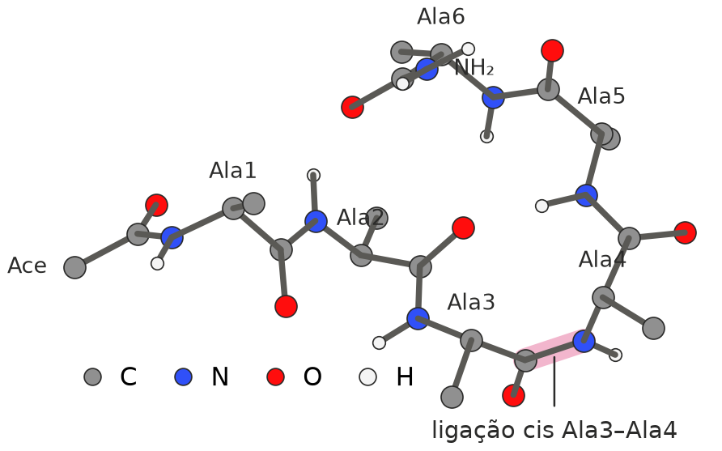

- **uso:** principal · **onde:** Metodologia › Sistema e dados · **questão:** apoia Q1
- **conferir números em:** notebook 05 §0 (tabela de ω)

**Legenda sugerida.** Ace-(Ala)₆-NH₂ em modelo de átomo unido (42 sítios; só os H polares são explícitos), no primeiro frame da trajetória de 500 K. Em destaque, a ligação peptídica entre Ala3 e Ala4, que é *cis* em todos os frames das duas trajetórias fornecidas; as demais são *trans* (a da acetila passa por um único episódio *cis* curto a 500 K). A ligação *cis* dobra a cadeia no meio. Renderização por projeção nos eixos principais do esqueleto.

## A — Descritores globais (Fase A)

### `A_rg_rmsd` — Raio de giro e RMSD ao longo da trajetória de 500 K

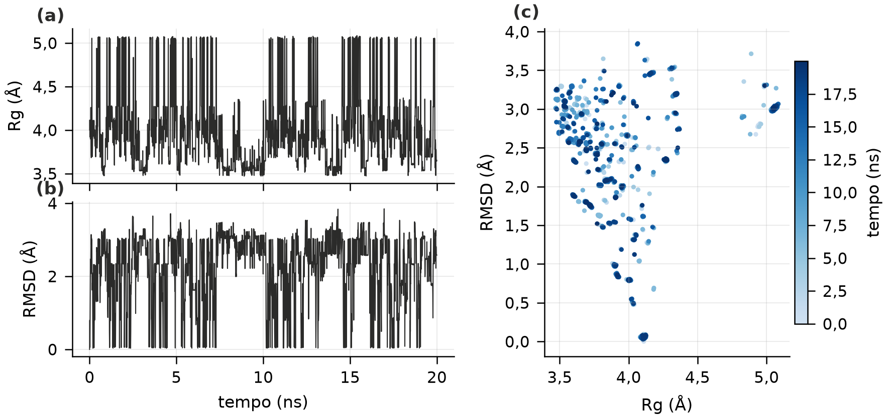

- **uso:** principal · **onde:** Resultados › Descritores globais · **questão:** Q2
- **conferir números em:** notebook 01, seção 'Calculation of features, part 1'

**Legenda sugerida.** (a) Raio de giro e (b) RMSD em relação ao primeiro frame, após superposição ótima, ao longo dos 20 ns a 500 K (1 frame = 10 ps). (c) Mapa Rg × RMSD colorido pelo tempo. O Rg varia entre 3,47 e 5,09 Å e o RMSD entre 0,00 e 3,85 Å; a molécula alterna entre patamares, e os pontos se agrupam em ilhas no mapa porque cada frame foi minimizado antes de ser gravado.

### `A_kmeans_rg_rmsd` — K-means do scikit-learn em (Rg, RMSD)

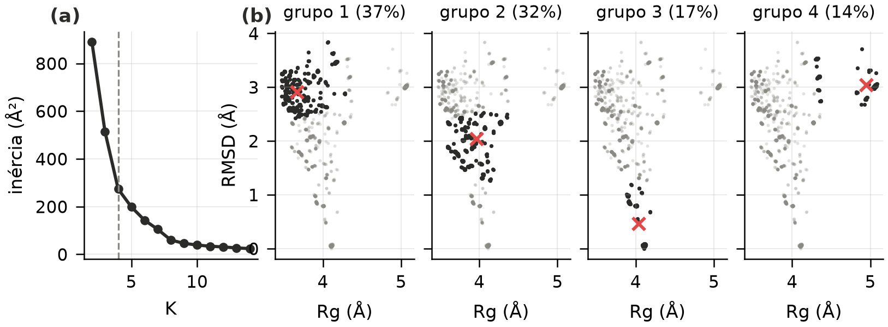

- **uso:** principal · **onde:** Resultados › Descritores globais · **questão:** Q4
- **conferir números em:** notebook 01, seções 'K-Means clustering' e 'Assessment of the clustering'

**Legenda sugerida.** (a) Cotovelo do K-means do scikit-learn sobre (Rg, RMSD), sem padronização, como no notebook do exercício (`random_state=0`). (b) Os quatro grupos para K = 4, um por painel (em preto; em cinza, a trajetória inteira; ×, o centroide). Sem padronização, o RMSD, que varia numa faixa 2,4 vezes maior que a do Rg, pesa mais na distância: três grupos são faixas de RMSD, e só o das conformações mais estendidas (Rg ≈ 5 Å) se separa pelo Rg.

## D — Ângulos diedros

### `D_ramachandran_500_300` — Mapas de Ramachandran por resíduo, 500 K e 300 K

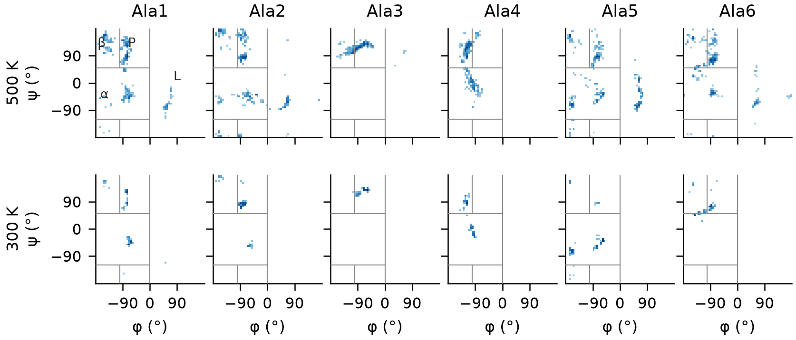

- **uso:** principal · **onde:** Resultados › Ângulos diedros
- **conferir números em:** notebook 05 §0 (tabela de ocupação)

**Legenda sugerida.** Densidade de frames no plano (φ, ψ) de cada resíduo, em escala logarítmica, a 500 K (acima) e a 300 K (abaixo). As linhas cinza delimitam as regiões usadas nos nomes dos estados: α (α_R), β, P (PPII) e L (α_L, φ > 0). Ala3 fica restrita à região estendida e Ala4 nunca chega a α_L, efeito da ligação *cis* entre elas; a 300 K a região α_L não é visitada.

### `D_ocupacao_regioes` — Ocupação das regiões de Ramachandran por resíduo

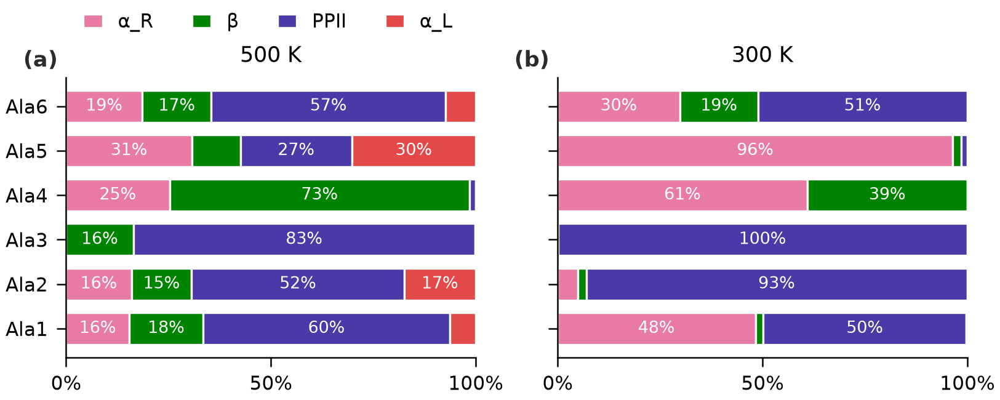

- **uso:** principal · **onde:** Resultados › Ângulos diedros
- **conferir números em:** notebook 05 §0 (tabela de ocupação)

**Legenda sugerida.** Fração do tempo que cada resíduo passa em cada região de Ramachandran, (a) a 500 K e (b) a 300 K. A 300 K não há α_L em nenhum resíduo; Ala5 fica quase só em α_R, e Ala3 fica sempre na região estendida nas duas temperaturas.

### `D_rg_temperaturas` — Distribuição do raio de giro a 500 K e 300 K

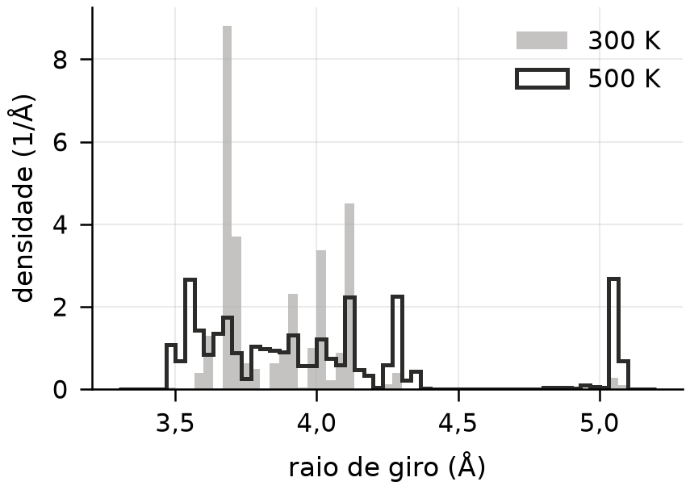

- **uso:** apêndice · **onde:** Resultados › Descritores globais
- **conferir números em:** molsim/data.py (massas por elemento)

**Legenda sugerida.** Distribuição do raio de giro nas duas temperaturas, com massas atribuídas pelo elemento. Com os nomes de tipo GROMOS do arquivo de 300 K, o MDAnalysis atribui massa zero a CH3, CH1 e NH1, e esta distribuição sairia errada sem aviso.

## B — K-means periódico (contribuição)

### `B_media_circular` — Média aritmética × média circular perto de ±180°

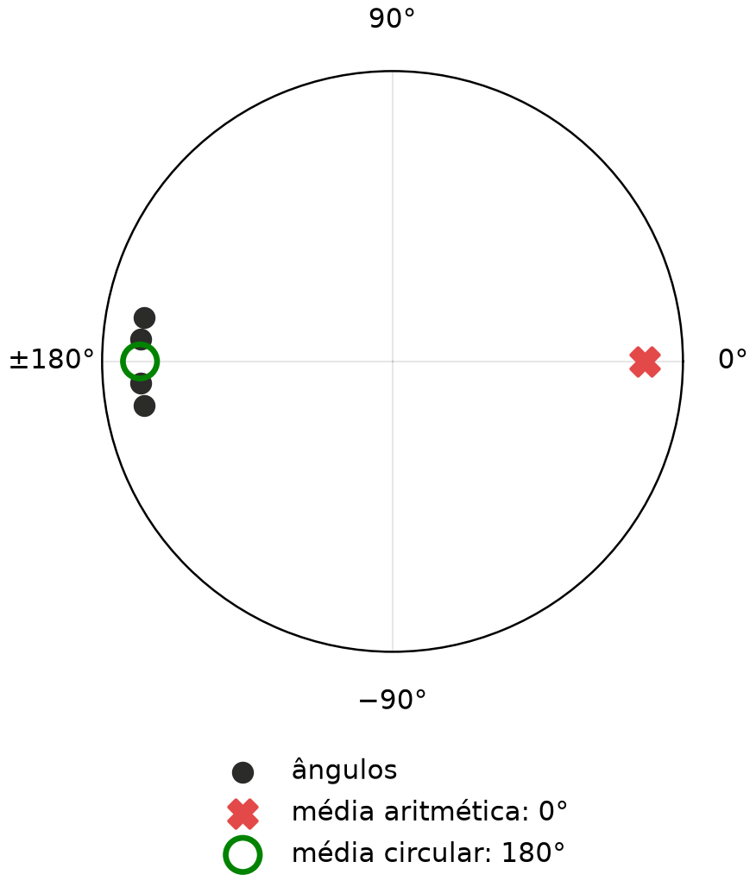

- **uso:** principal · **onde:** Metodologia › K-means periódico
- **conferir números em:** tests/test_kmeans_variants.py

**Legenda sugerida.** Os ângulos −170°, 175°, 170° e −175° estão todos a menos de 10° de ±180°. A média aritmética (0°) cai do lado oposto do círculo, com Σd² = 119 050 grau²; a média circular, μ = atan2(⟨sin θ⟩, ⟨cos θ⟩), dá 180° e Σd² = 250 grau². É a atualização da variante `tutorial` (a do material de referência) que produz o primeiro resultado.

### `B_convergencia` — Ciclo limite e monotonicidade das três variantes

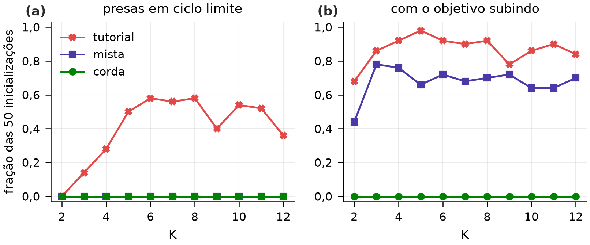

- **uso:** principal · **onde:** Resultados › K-means periódico · **questão:** Q6
- **conferir números em:** notebook 02, 'Comparação das três variantes'

**Legenda sugerida.** Programa de medida sobre os 12 diedros a 500 K, com 50 inicializações por K. (a) A variante `tutorial` fica presa em ciclo limite em 14% a 58% das inicializações para K ≥ 3; `mista` e `corda` nunca. (b) Só em `corda`, em que a atualização é o minimizador exato da métrica de atribuição, o objetivo nunca sobe entre iterações (0 violações em 550 rodadas).

### `B_historico_objetivo` — Objetivo a cada iteração, mesma inicialização

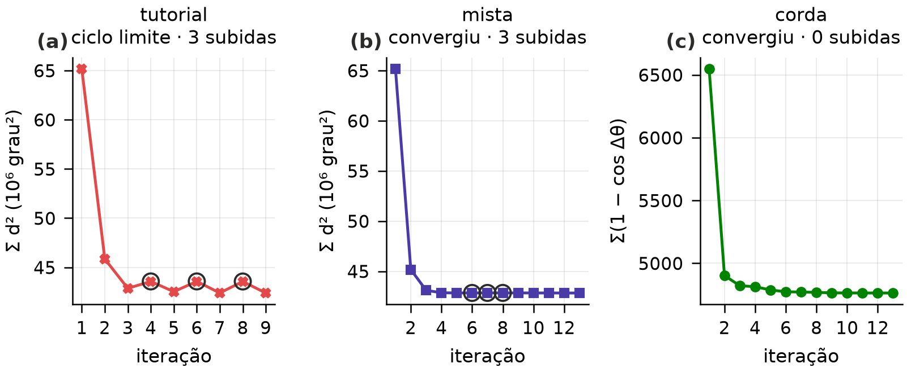

- **uso:** apêndice · **onde:** Resultados › K-means periódico · **questão:** Q6
- **conferir números em:** molsim/kmeans_variants.py (objective_history)

**Legenda sugerida.** Objetivo de cada variante a cada iteração, com K = 4 e a mesma inicialização (semente 2); círculos marcam iterações em que o objetivo subiu. Cada painel tem a sua própria unidade: as variantes otimizam objetivos diferentes e não são comparáveis pela altura das curvas. `tutorial` alterna entre duas partições até repetir uma já visitada (ciclo limite); `corda` desce a cada passo, como a teoria garante.

### `B_cotovelo_corda` — Cotovelo da variante coerente

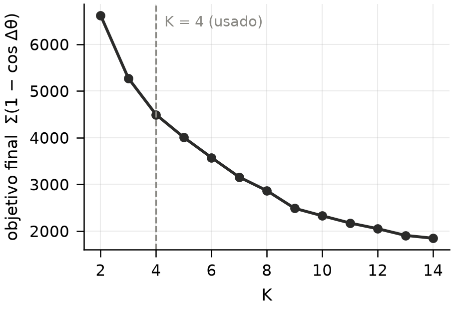

- **uso:** principal · **onde:** Resultados › Escolha de K · **questão:** Q4
- **conferir números em:** notebook 05 §1.0

**Legenda sugerida.** Objetivo final da variante `corda` (melhor de 50 inicializações) em função de K. O ganho relativo ao passar de K para K+1 cai só de 15% (3→4) para 11% (4→5) e fica entre 9% e 13% até K = 9; depois cai para ~6%. O joelho em K = 4 é fraco: K = 4 foi mantido para comparação com o material de referência, não porque o cotovelo o determine.

### `B_ari_metodos` — Concordância entre métodos de agrupamento (ARI)

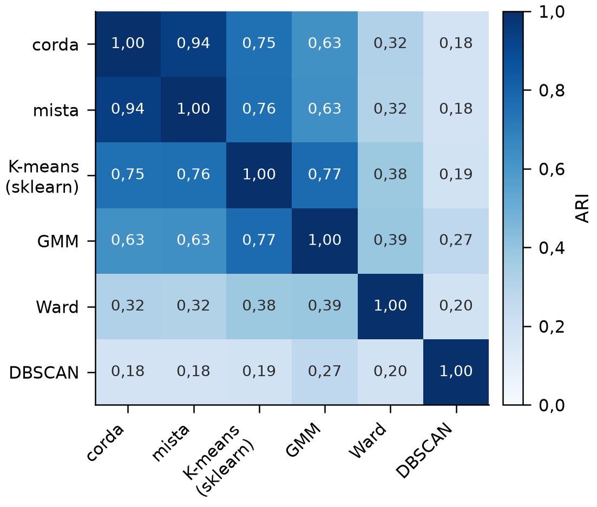

- **uso:** principal · **onde:** Resultados › Comparação com outros métodos · **questão:** Q7
- **conferir números em:** notebook 02, 'Baselines: GMM, aglomerativo (Ward) e DBSCAN'

**Legenda sugerida.** Índice de Rand ajustado entre as partições de seis métodos sobre os 12 diedros a 500 K (1 = partições idênticas, 0 = concordância de acaso). Só `corda` e `mista` tratam a periodicidade; GMM, Ward e o K-means do scikit-learn usam distância euclidiana nos ângulos crus, e o DBSCAN (eps = 30°, min_samples = 12) escolhe sozinho o número de grupos. A partição `corda` desta figura (semente 0) coincide com a partição de referência (ARI = 0,99).

### `B_sementes` — Reprodutibilidade da partição K = 4

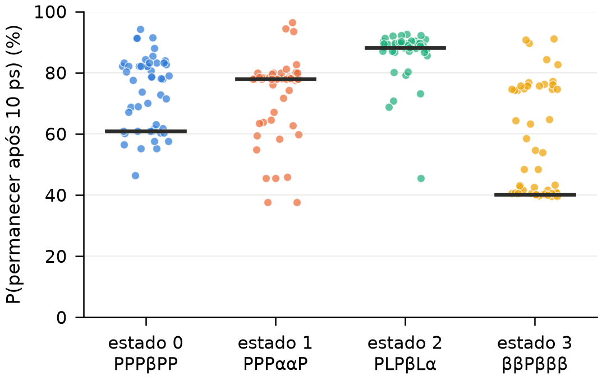

- **uso:** principal · **onde:** Resultados › Escolha de K · **questão:** Q3
- **conferir números em:** notebook 05 §1.2

**Legenda sugerida.** Probabilidade de permanecer em cada estado após 10 ps, para 50 inicializações da variante `corda` com K = 4 (pontos), alinhadas aos estados de referência pelo centroide, contra a partição de referência (traço). As 50 sementes chegam a 43 mínimos locais distintos, e só 6% delas ao de menor objetivo: o mesmo estado vai de passageiro a quase permanente conforme a inicialização.

## E — Os estados

### `E_ramachandran_estados` — Assinatura de Ramachandran de cada estado

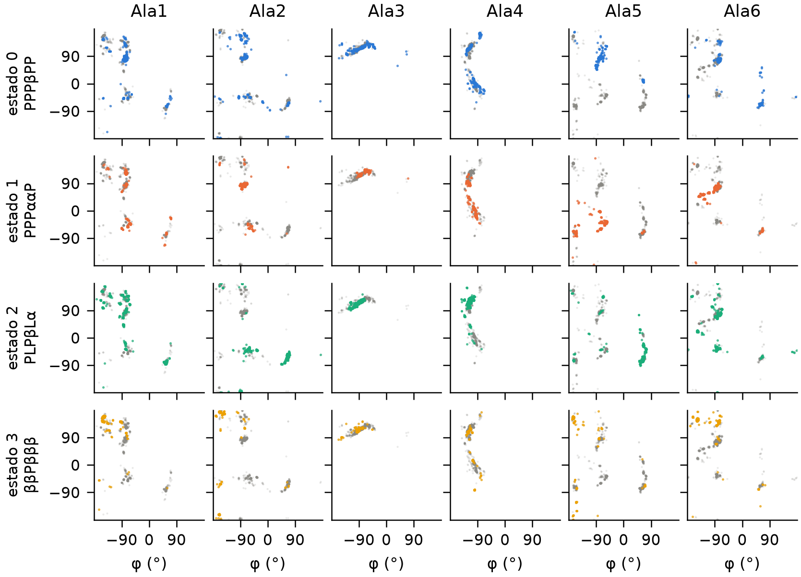

- **uso:** principal · **onde:** Resultados › Os estados · **questão:** Q5
- **conferir números em:** notebook 05 §1.1

**Legenda sugerida.** Cada linha é um estado da partição de referência (K = 4, variante `corda`) e cada coluna um resíduo: em cinza a trajetória inteira de 500 K, em cor os frames do estado. O nome resume o centroide com uma letra por resíduo, de Ala1 a Ala6: α (α_R), β, P (PPII) e L (α_L). Os eixos vão de −180° a 180°.

### `E_dpca_estados` — Os estados na PCA dos diedros

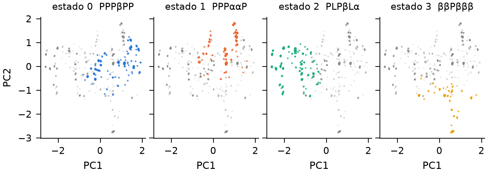

- **uso:** apêndice · **onde:** Resultados › Os estados
- **conferir números em:** notebook 05 §1.1

**Legenda sugerida.** Projeção nos dois primeiros componentes principais dos diedros, calculados na imersão (cos θ, sin θ) para respeitar a periodicidade (PCA nos ângulos crus trataria −179° e 179° como opostos). PC1 e PC2 explicam 44% da variância; os estados se sobrepõem na projeção, que perde a maior parte da informação.

### `E_estabilidade` — Energia livre e estabilidade dos estados

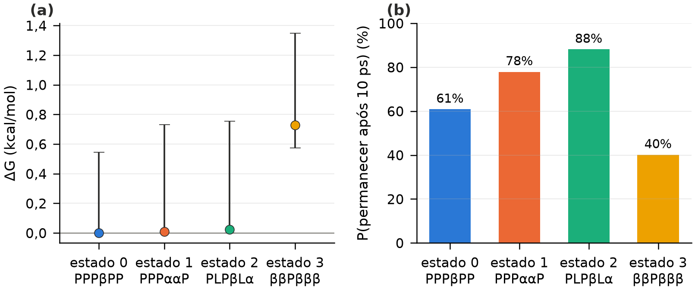

- **uso:** principal · **onde:** Resultados › Os estados · **questão:** Q7
- **conferir números em:** notebook 05 §1.1 (tabela)

**Legenda sugerida.** (a) Energia livre relativa ΔG = −k_B T ln(p_i/p_max) a 500 K, com intervalo de 95% por bootstrap em 10 blocos contíguos. Os estados 0, 1 e 2 têm populações entre 28% e 29% e não se distinguem em ΔG; o estado 3 (14%) fica 0,73 kcal/mol acima. (b) Probabilidade de o estado seguinte (10 ps depois) ser o mesmo.

### `E_medoides` — Estruturas representativas (medoides) dos estados

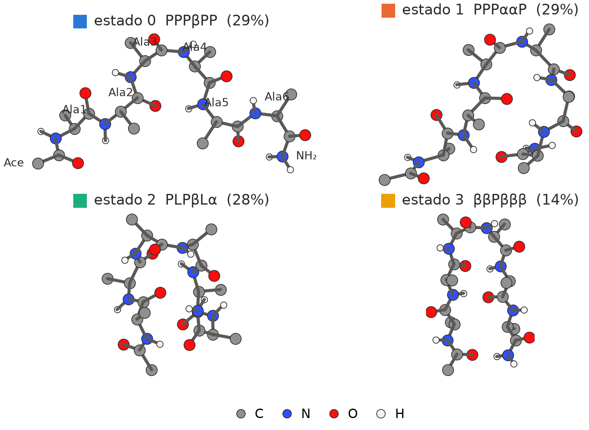

- **uso:** principal · **onde:** Resultados › Os estados · **questão:** Q5
- **conferir números em:** figs/relatorio/estruturas/

**Legenda sugerida.** Medoide de cada estado — o frame com a menor soma de distâncias de corda aos demais membros —, superposto ao do estado 0 pelos átomos do esqueleto e visto na mesma orientação (frames 1085, 132, 787, 450 da trajetória de 500 K). Mesmo com todos os resíduos na região estendida (estado 3), a cadeia se dobra: é a ligação *cis* entre Ala3 e Ala4 que a vira. As coordenadas estão em `figs/relatorio/estruturas/` para renderização em VMD, VESTA ou PyMOL.

## C — Critério cinético

### `C_residencia` — Tempos de residência nos estados

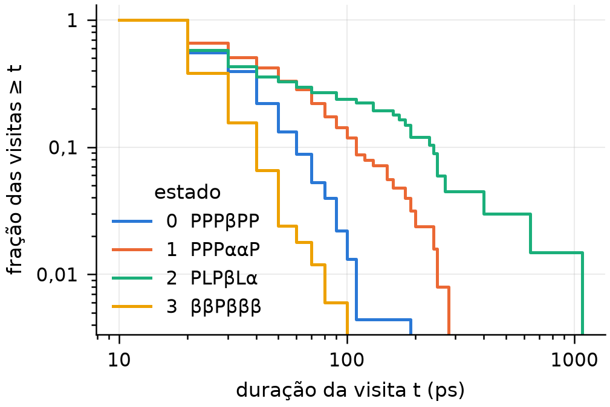

- **uso:** apêndice · **onde:** Resultados › Critério cinético
- **conferir números em:** notebook 05 §2.1

**Legenda sugerida.** Fração das visitas a cada estado que duram pelo menos t (primeira e última visita da trajetória descartadas). As durações médias vão de 17 a 83 ps; só o estado 2, o único com resíduos em α_L, tem visitas longas (cauda até ~1 ns).

### `C_its` — Escalas de tempo implícitas: K = 4 contra microestados

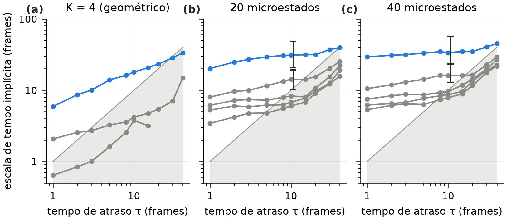

- **uso:** principal · **onde:** Resultados › Critério cinético · **questão:** Q7
- **conferir números em:** notebook 05 §2.2 e §3

**Legenda sugerida.** Escalas de tempo implícitas t_i(τ) = −τ / ln λ_i(τ) em função do tempo de atraso (1 frame = 10 ps); em azul, o processo mais lento; na região cinza, t < τ, os processos não são resolvidos. (a) Com os 4 estados geométricos a escala mais lenta sobe de 5,9 para 33,6 frames, sem patamar: a partição não é markoviana. (b, c) Com microestados, um processo fica claramente separado dos demais: com 40 microestados e τ = 10 frames, t₁ = 0,34 ns (IC 95%: 0,24–0,57 ns) e t₂ = 0,16 ns (0,13–0,23 ns). Barras: IC 95% por bootstrap em 10 blocos.

### `C_macroestados_alfaL` — O processo lento: entrada e saída de α_L

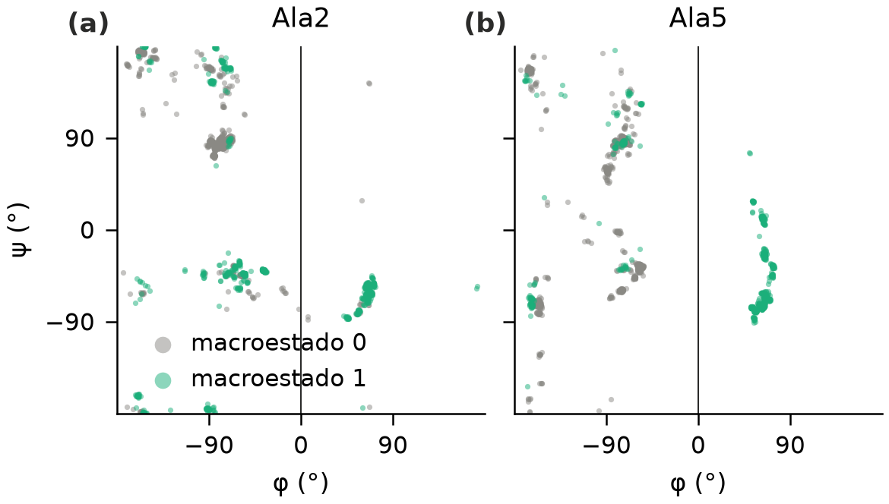

- **uso:** principal · **onde:** Resultados › Critério cinético · **questão:** Q7
- **conferir números em:** notebook 05 §4

**Legenda sugerida.** Divisão dos 40 microestados em dois macroestados pelo sinal do autovetor do processo mais lento, vista no Ramachandran de (a) Ala2 e (b) Ala5. O macroestado 1 coincide com 'algum resíduo em α_L (φ > 0)' em 90,0% dos frames: no macroestado 1, Ala2 está em α_L em 43% e Ala5 em 80% dos frames, contra 2% e 0% no macroestado 0.

### `C_rotulos_tempo` — Sequência temporal dos estados, 500 K e 300 K

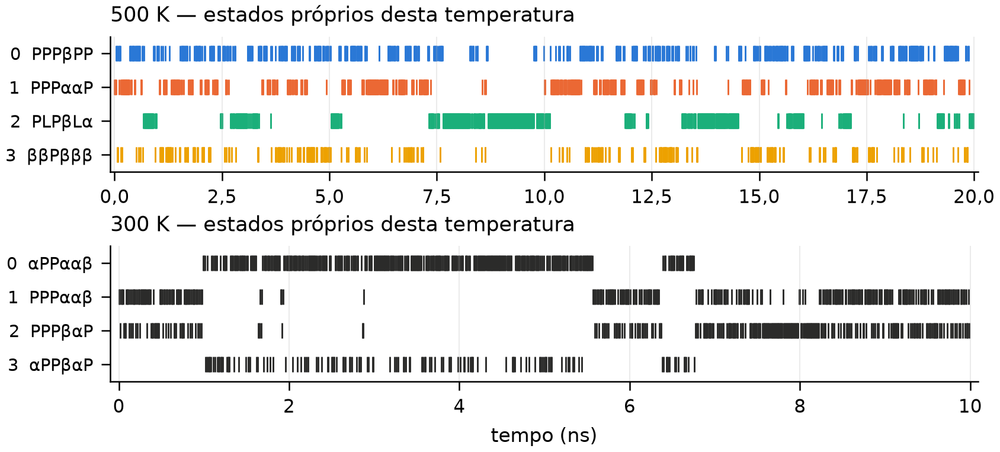

- **uso:** principal · **onde:** Resultados › Comparação 500 K × 300 K · **questão:** Q7
- **conferir números em:** notebook 05 §5.2

**Legenda sugerida.** Estado em cada frame. A 500 K (acima, cores dos estados de referência), o estado 2 — o único com α_L — aparece em blocos longos. A 300 K (abaixo, em preto: estes estados são outros, agrupados na própria trajetória de 300 K), os estados com Ala1 em α_R só aparecem entre 1,0 e 6,8 ns: um único evento lento em 10 ns, o que impede estimar populações de equilíbrio a 300 K. O KNN treinado a 500 K põe 96,5% dos frames de 300 K num único estado de 500 K.

## Tabelas sugeridas

Os números vêm impressos nos notebooks; copie de lá.

| tabela | onde |
|---|---|
| ω das seis ligações peptídicas, 500 K e 300 K | notebook 05 §0 |
| ocupação das regiões de Ramachandran por resíduo | notebook 05 §0 |
| estados de referência: nome, população, ΔG com IC 95%, P(permanecer) | notebook 05 §1.1 |
| convergência por variante e K (ciclo, violações, iterações) | notebook 02, "Comparação das três variantes" |
| ARI entre métodos | notebook 02, "Baselines" |
| escalas de tempo implícitas com IC 95% (20 e 40 microestados) | notebook 05 §3 |
| populações a 300 K pelo KNN (k = 1, 5, 15) | notebook 05 §5.1 |
| estados próprios de 300 K: visitas, primeiro e último frame | notebook 05 §5.2 |

## Mapa das questões do exercício

| questão | figuras |
|---|---|
| Q1 — por que não usar as coordenadas cruas | S_estrutura (argumento conceitual) |
| Q2 — o que se observa em Rg e RMSD | A_rg_rmsd |
| Q3 — rodar o K-means várias vezes | B_sementes |
| Q4 — um bom valor de K | A_kmeans_rg_rmsd, B_cotovelo_corda |
| Q5 — as estruturas de um cluster se parecem? | E_ramachandran_estados, E_medoides |
| Q6 — medida de convergência | B_convergencia, B_historico_objetivo |
| Q7 — melhores features e número de estados | C_its, C_macroestados_alfaL, B_ari_metodos, E_estabilidade, C_rotulos_tempo |
